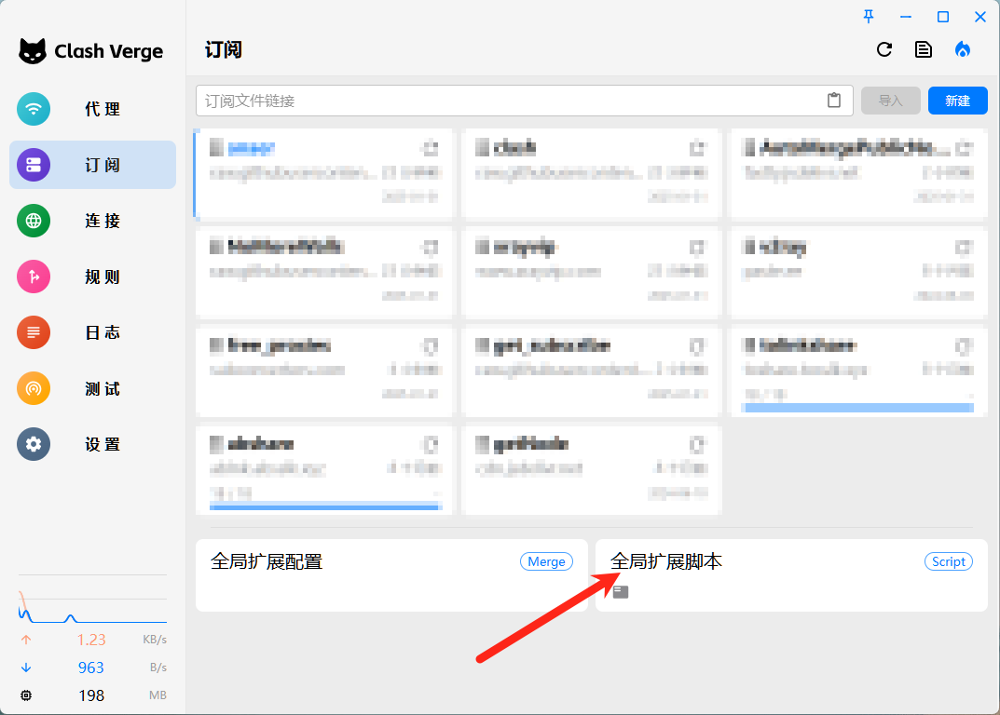
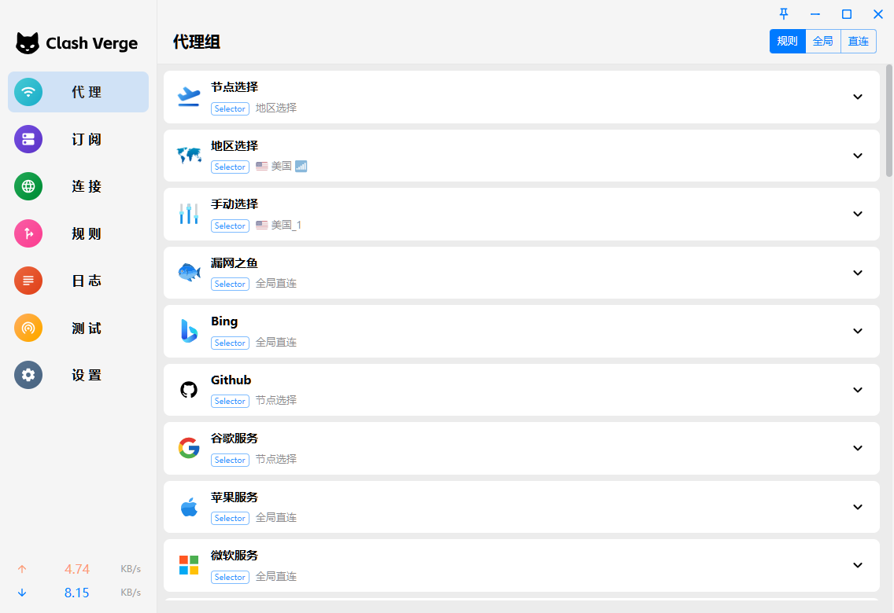
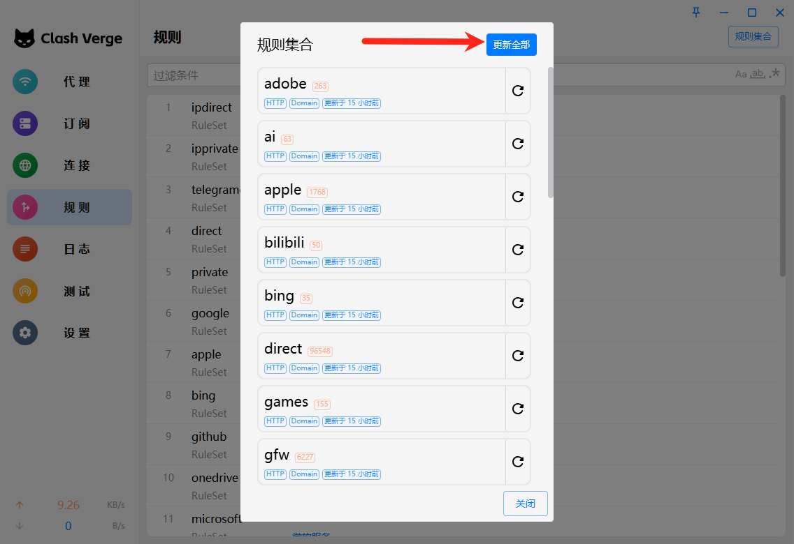

# ClashVerge个人配置

> 由于免费的 `Clash` 节点配置太乱，所以参考官方文档自己配置了一下。

## 安装 Clash Verge

### 1. 下载安装包安装

https://github.com/clash-verge-rev/clash-verge-rev/releases

### 2. scoop

1. 添加配置

```cmd
scoop bucket add apps https://github.com/kkzzhizhou/scoop-apps
```

2. 安装Clash Verge

```cmd
scoop install clash-verge-rev
```

## 配置 Clash Verge

> `github`上有一堆，搜一下，随便复制就可以了

## Clash 通用规则设置

### 1. 插入脚本

> 点击订阅，右键点击右下角`全局扩展脚本`, 编辑文件，添加以下脚本：

> [**👉单击此处打开文件：`GlobalScript.js`**](https://github.com/mwmi/ClashVergeGlobalScript/raw/master/GlobalScript.js "🌟鼠标右键另存为脚本")

如图:




### 2. 更新规则

**⚠️注意：安装脚本安装完后一定要点击更新规则，否则脚本是无法生效的。**

> 点击左边栏`规则` -> 左上角 `规则合集` -> `更新全部`



至此，脚本配置完成。